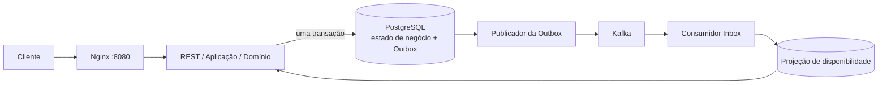

# Flash Booking

## Visão geral

Flash Booking é o núcleo transacional de uma plataforma de ingressos com capacidade limitada. Durante uma venda
relâmpago, várias instâncias podem disputar o mesmo evento; o PostgreSQL continua sendo a fonte de verdade, e uma
atualização condicional atômica impede vendas acima da capacidade. Os comandos de reserva têm consistência forte,
enquanto a disponibilidade é uma projeção intencionalmente eventual, alimentada por Outbox transacional, Kafka e um
consumidor Inbox idempotente.

A demonstração funciona inteiramente no ambiente local: não exige conta de nuvem, banco remoto, Kafka gerenciado, SaaS
nem gerenciador externo de segredos.

## Arquitetura



O código segue fronteiras hexagonais pragmáticas: HTTP, persistência e mensageria são adaptadores ao redor das portas de
aplicação e dos objetos de domínio. O CQRS é aplicado especificamente à disponibilidade; a consulta de reserva ainda lê
sua tabela transacional. Trata-se de propagação de estado orientada a eventos, **não de Event Sourcing**.

## Tecnologias

- **Java 21 / Spring Boot 3** — aplicação e execução HTTP.
- **PostgreSQL 17** — capacidade autoritativa, reservas, idempotência, Outbox, Inbox e projeção.
- **Kafka (KRaft)** — transporte assíncrono local com entrega pelo menos uma vez.
- **Flyway** — criação e evolução automática do schema.
- **Springdoc OpenAPI / Swagger UI** — contrato interativo da API.
- **Actuator, Micrometer e Prometheus registry** — endpoints de saúde e métricas.
- **Testcontainers, JUnit, ArchUnit e JaCoCo** — testes de integração, concorrência, arquitetura e cobertura.
- **k6** — cenário opcional e conteinerizado de carga para venda relâmpago.

## Principais decisões de engenharia

- **Nenhuma venda excessiva:** `UPDATE events ... WHERE available_tickets >= ?` é atômico; as constraints do banco são
  a proteção final.
- **Idempotência:** advisory lock transacional no PostgreSQL e chave única persistente serializam disputas da mesma chave
  entre instâncias. O mesmo payload repete o resultado original; um payload diferente retorna `409`.
- **Outbox transacional:** estado de negócio e envelope versionado são confirmados juntos, evitando dual write.
- **Kafka pelo menos uma vez + Inbox:** duplicatas podem ocorrer; o consumidor deduplica `(event_id, consumer)`.
- **CQRS para disponibilidade:** `GET /eventos/{id}` lê uma projeção assíncrona. O Kafka nunca decide uma venda.
- **Aprovação automática:** a reserva permanece `PENDING` por dez segundos e um worker com `SKIP LOCKED` a aprova;
  a capacidade já fica retida atomicamente desde a criação para impedir venda excessiva.

Consulte os [ADRs](docs/adr/) e os [detalhes da arquitetura](docs/architecture.md).

## Execução local

Pré-requisito: Docker com Docker Compose (Git é necessário apenas para clonar). O fluxo principal não exige Java,
Maven, PostgreSQL, Kafka ou k6 instalados na máquina.

```bash
docker compose up --build
```

O Compose inicia PostgreSQL, Kafka, uma ou mais réplicas da aplicação e o Nginx. O Flyway migra o banco vazio e o Spring
cria os tópicos Kafka. Os padrões locais são usuário/senha `flash/flash`. As portas expostas são `8080` para a aplicação,
`5433` para PostgreSQL (configurável com `POSTGRES_PORT`) e `9092` para Kafka.

```bash
docker compose down       # preserva o volume do PostgreSQL
docker compose down -v    # também apaga os dados locais
```

Não é necessário arquivo `.env`. As principais variáveis são `DB_*`, `KAFKA_BOOTSTRAP_SERVERS`,
`KAFKA_EVENTS_TOPIC`, `RESERVATION_TTL`, `OUTBOX_FIXED_DELAY_MS`, `APPROVAL_FIXED_DELAY_MS` e `SERVER_PORT`.

### Execução pela IDE

Ao executar a aplicação Spring Boot na máquina, inicie apenas a infraestrutura:

```bash
docker compose up -d postgres kafka
./mvnw spring-boot:run
```

Os padrões coincidem com o Compose: banco `flash_booking`, usuário/senha `flash/flash`, PostgreSQL em `localhost:5433` e
Kafka em `localhost:9092`. A porta `5433` evita conexão acidental com outro PostgreSQL na porta padrão `5432`.

Se aparecer `FATAL: role "flash" does not exist`, recrie o container e confira a porta e o log:

```bash
docker compose up -d --force-recreate postgres kafka
docker compose port postgres 5432
docker compose logs postgres
```

O comando de porta deve mostrar `5433`. Remova também valores antigos de `DB_URL`, `DB_USER`, `DB_PASSWORD` ou
`SPRING_DATASOURCE_*` da configuração da IDE. A imagem oficial só aplica `POSTGRES_DB`, `POSTGRES_USER` e
`POSTGRES_PASSWORD` ao inicializar um diretório vazio. Para dados locais descartáveis:

```bash
docker compose down -v
docker compose up -d postgres kafka
```

Para usar outra porta no host:

```bash
POSTGRES_PORT=15432 docker compose up -d --force-recreate postgres kafka
DB_URL=jdbc:postgresql://localhost:15432/flash_booking ./mvnw spring-boot:run
```

## API e Swagger

- API: <http://localhost:8080>
- Swagger UI: <http://localhost:8080/swagger-ui.html>
- JSON OpenAPI: <http://localhost:8080/v3/api-docs>

O contrato público contém `POST /eventos`, `GET /eventos/{id}`, `POST /eventos/{id}/reservas`,
`GET /reservas/{id}` e `DELETE /reservas/{id}`. A criação de reserva exige `Idempotency-Key` de 1 a 160 caracteres.
Erros usam documentos `ProblemDetail` com o tipo `application/problem+json`.

## Fluxo de exemplo

```bash
./scripts/demo.sh
./scripts/demo-idempotency.sh
./scripts/demo-concurrency.sh
```

Os scripts usam shell POSIX, `curl` e utilitários padrão; os IDs são criados dinamicamente. O `demo.sh` aguarda a
prontidão, cria e consulta um evento, reserva, repete a mesma chave, observa a projeção, cancela e confere o estado final.

## Testes

Utilize Java 21 fora dos containers. O wrapper baixa Maven 3.9.11 na primeira execução:

```bash
./mvnw clean test    # testes unitários, de aplicação, API, mensageria e ArchUnit
./mvnw clean verify  # inclui integração/concorrência com Testcontainers e relatório JaCoCo
```

A suíte completa requer um daemon Docker. Veja [docs/testing.md](docs/testing.md).

## Teste de carga e múltiplas instâncias

```bash
docker compose up --build --scale app=3
EVENT_ID=<uuid> VUS=100 DURATION=30s QUANTITY=1 docker compose --profile load-test run --rm k6
```

O Nginx mantém uma porta estável enquanto o DNS do Docker encontra as réplicas. O k6 trata respostas `422` por
ingressos esgotados como resultado de negócio, não falha técnica; ele demonstra carga, mas não prova correção.

## Observabilidade

- Saúde: <http://localhost:8080/actuator/health>
- Vivacidade: <http://localhost:8080/actuator/health/liveness>
- Prontidão: <http://localhost:8080/actuator/health/readiness>
- Catálogo de métricas: <http://localhost:8080/actuator/metrics>
- Formato Prometheus: <http://localhost:8080/actuator/prometheus>

O cliente pode fornecer um UUID em `X-Correlation-Id`; caso contrário, um valor é gerado, devolvido, registrado e
propagado nos eventos de domínio. Veja [docs/observability.md](docs/observability.md).

## Documentação

- [Arquitetura](docs/architecture.md)
- [Fluxo orientado a eventos](docs/event-driven-architecture.md)
- [Concorrência](docs/concurrency.md)
- [Regras de negócio](docs/business-rules.md)
- [Testes](docs/testing.md)
- [Observabilidade](docs/observability.md)
- [Guia de revisão de código](docs/code-review-guide.md)
- [Registros de decisões arquiteturais](docs/adr/)

## Compromissos arquiteturais

O PostgreSQL oferece correção simples e forte, mas um evento extremamente popular vira uma linha disputada. A Outbox
remove a perda por dual write ao custo de polling e visibilidade assíncrona. O transporte pelo menos uma vez exige
idempotência na Inbox. A projeção desacopla consultas, mas pode retornar temporariamente um valor antigo ou `404`.

## Melhorias futuras

Em escala muito maior, avaliar propriedade particionada de eventos ou sharding, CDC/Debezium no lugar do polling da
Outbox, armazenamento de leitura dedicado, governança de schemas, backpressure, sala de espera, limitação de taxa,
autoscaling, tracing distribuído e retenção/particionamento de histórico. Autenticação e pagamentos estão fora do escopo.
