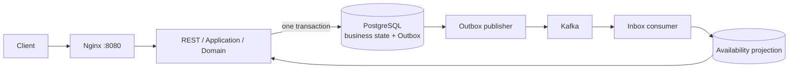

# Flash Booking

## Overview

Flash Booking is the transactional core of a limited-capacity ticket platform. During a flash sale, many application
instances may compete for the same event; PostgreSQL remains the authority and an atomic conditional update prevents
overselling. Reservation commands are strongly consistent, while event availability is a deliberately eventually
consistent projection fed through a transactional Outbox, Kafka and an idempotent Inbox consumer.

The demonstration is entirely local: no cloud account, remote database, managed Kafka, SaaS, or external secret manager
is required.

## Architecture



The code follows pragmatic hexagonal boundaries: HTTP and persistence/messaging are adapters around application ports
and domain objects. CQRS is applied specifically to event availability; reservation lookup still reads its transactional
table. This is event-driven state propagation, **not Event Sourcing**.

## Technology Stack

- **Java 21 / Spring Boot 3** — application and HTTP runtime.
- **PostgreSQL 17** — authoritative capacity, reservations, idempotency, Outbox, Inbox, and projection storage.
- **Kafka (KRaft)** — local asynchronous event transport with at-least-once delivery.
- **Flyway** — automatic schema creation and evolution.
- **Springdoc OpenAPI / Swagger UI** — interactive API contract.
- **Actuator, Micrometer, Prometheus registry** — health and metrics endpoints.
- **Testcontainers, JUnit, ArchUnit, JaCoCo** — integration, concurrency, architecture, and coverage validation.
- **k6** — optional containerized flash-sale load scenario.

## Key Engineering Decisions

- **Zero oversell:** `UPDATE events ... WHERE available_tickets >= ?` is atomic; database constraints are the final
  guard.
- **Idempotency:** a transaction-scoped PostgreSQL advisory lock and persistent unique key serialize same-key races
  across
  instances; same payload replays the original result and a changed payload returns `409`.
- **Transactional Outbox:** business state and a versioned event envelope commit together, avoiding a database/Kafka
  dual-write window.
- **At-least-once Kafka + Inbox:** duplicates can occur between broker acknowledgement and Outbox completion; the
  consumer
  deduplicates `(event_id, consumer)` in the projection transaction.
- **CQRS for availability:** `GET /events/{id}` reads an asynchronous projection. Kafka never decides whether a ticket
  is sold.
- **Single-winner terminal transitions:** row locks and `SKIP LOCKED` coordinate cancellation and expiration workers.

See the [ADRs](docs/adr/) and [architecture detail](docs/architecture.md).

## Running Locally

Prerequisite: Docker with Docker Compose (Git is needed only to clone). Java, Maven, PostgreSQL, Kafka, and k6 do not
need
to be installed for the main path.

```bash
docker compose up --build
```

Compose starts PostgreSQL, Kafka, one or more application replicas, and an Nginx entry point. Health checks order
startup;
Flyway migrates an empty database and Spring creates the Kafka topics. Local-only defaults are `flash/flash` for the
PostgreSQL user/password. Ports exposed to the host are application `8080`, PostgreSQL `5433` by default (configurable
with `POSTGRES_PORT`), and Kafka `9092`; the last two are exposed for optional development/debugging.

```bash
docker compose down       # keep PostgreSQL volume
docker compose down -v    # also delete local data
```

No `.env` file is required. Runtime overrides include `DB_*`, `KAFKA_BOOTSTRAP_SERVERS`, `KAFKA_EVENTS_TOPIC`,
`RESERVATION_TTL`, `OUTBOX_FIXED_DELAY_MS`, `EXPIRATION_FIXED_DELAY_MS`, and `SERVER_PORT`.

### Running the application from the IDE

When the Spring Boot application runs on the host (for example, from IntelliJ), start only its infrastructure
dependencies. Starting the complete Compose stack also starts another application instance and reserves host port
`8080` for Nginx.

```bash
docker compose up -d postgres kafka
./mvnw spring-boot:run
```

The application's defaults match Compose: database `flash_booking`, user/password `flash/flash`, PostgreSQL on
`localhost:5433`, and Kafka on `localhost:9092`. Port `5433` is intentional: it prevents an application started from the
IDE from silently connecting to another PostgreSQL installation on the standard port `5432`. An IDE run configuration
therefore does not need environment variables
unless those defaults have been overridden. The Compose health check performs an authenticated query (rather than only
checking whether a PostgreSQL server is listening), so an old or incorrectly initialized database is reported as
unhealthy before the application starts.

If startup reports `FATAL: role "flash" does not exist`, PostgreSQL is reachable, but the server listening on port
configured by `DB_URL` was not initialized with this project's credentials. Recreate the PostgreSQL container so the
current port mapping is applied, then verify the exact host port and initialization log:

```bash
docker compose up -d --force-recreate postgres kafka
docker compose port postgres 5432
docker compose logs postgres
```

`docker compose port postgres 5432` must print `5433` as the host port (the address can be `0.0.0.0`, `127.0.0.1`, or
`[::]`). Also remove stale `DB_URL`, `DB_USER`, `DB_PASSWORD`, or `SPRING_DATASOURCE_*` values from the IDE run
configuration; otherwise they override the defaults above.

The official PostgreSQL image applies `POSTGRES_DB`, `POSTGRES_USER`, and `POSTGRES_PASSWORD` only when it initializes an
empty data directory. Consequently, a named volume created with older credentials is not changed by restarting the
container. For disposable local data, recreate that volume and start the infrastructure again:

```bash
docker compose down -v
docker compose up -d postgres kafka
```

This deletes the local PostgreSQL data. The Compose volume is versioned as `postgres_data_v1`, ensuring installations
that used an older project volume get a clean initialization with the documented credentials. If the data must be
preserved, create the `flash` login/database with an existing
PostgreSQL administrator or set `DB_URL`, `DB_USER`, and `DB_PASSWORD` in the IDE to credentials already present in that
database instead of removing the volume.

To use a host port other than `5433`, publish the container on that port and give the host-run application the matching
JDBC URL:

```bash
POSTGRES_PORT=15432 docker compose up -d --force-recreate postgres kafka
DB_URL=jdbc:postgresql://localhost:15432/flash_booking ./mvnw spring-boot:run
```

## API / Swagger

- API: <http://localhost:8080>
- Swagger UI: <http://localhost:8080/swagger-ui.html>
- OpenAPI JSON: <http://localhost:8080/v3/api-docs>

The public contract consists of `POST /events`, `GET /events/{id}`, `POST /events/{id}/reservations`,
`GET /reservations/{id}`, and `DELETE /reservations/{id}`. Reservation creation requires `Idempotency-Key` (1–160
chars).
Errors use `application/problem+json` `ProblemDetail` documents.

## Example Flow

```bash
./scripts/demo.sh
./scripts/demo-idempotency.sh
./scripts/demo-concurrency.sh
```

The scripts use POSIX shell, `curl`, and standard text utilities; IDs are created dynamically. `demo.sh` waits for
readiness, creates and queries an event, reserves, replays the same key, observes projected availability, cancels, and
observes the final state.

## Testing

For development outside containers, use Java 21; the committed wrapper downloads Maven 3.9.11 on first use:

```bash
./mvnw clean test    # unit, application, API, messaging unit, and ArchUnit tests
./mvnw clean verify  # also Testcontainers integration/concurrency tests and JaCoCo report
```

The full suite needs a Docker daemon for Testcontainers. Details: [docs/testing.md](docs/testing.md).

## Load Testing and Multiple Instances

```bash
docker compose up --build --scale app=3
EVENT_ID=<uuid> VUS=100 DURATION=30s QUANTITY=1 docker compose --profile load-test run --rm k6
```

Nginx keeps one stable host port while Docker DNS discovers scaled `app` replicas. k6 treats `422` sellout responses as
business outcomes, not technical failures; it is a load demonstration, not the correctness proof.

## Observability

- Health: <http://localhost:8080/actuator/health>
- Liveness: <http://localhost:8080/actuator/health/liveness>
- Readiness: <http://localhost:8080/actuator/health/readiness>
- Metrics catalog: <http://localhost:8080/actuator/metrics>
- Prometheus exposition: <http://localhost:8080/actuator/prometheus>

Clients may supply a UUID `X-Correlation-Id`; otherwise one is generated, returned, logged, and propagated in domain
events. See [docs/observability.md](docs/observability.md).

## Documentation

- [Architecture](docs/architecture.md)
- [Event-driven flow](docs/event-driven-architecture.md)
- [Concurrency](docs/concurrency.md)
- [Business rules](docs/business-rules.md)
- [Testing](docs/testing.md)
- [Observability](docs/observability.md)
- [Code review guide](docs/code-review-guide.md)
- [Architecture Decision Records](docs/adr/)

## Trade-offs

PostgreSQL correctness is simple and strong but a single extremely popular event becomes a hot row. Transactional Outbox
removes dual-write loss at the cost of polling and asynchronous visibility. At-least-once transport is practical but
requires Inbox idempotency. The availability projection decouples query work but may briefly return an old value or
`404`.

## Future Improvements

At substantially larger scale, evaluate partitioned event ownership or sharding, CDC/Debezium instead of Outbox polling,
a dedicated read store, schema governance, backpressure and a waiting room, rate limiting, autoscaling, distributed
tracing, and history retention/partitioning. Authentication and payment workflow are intentionally outside this case.
