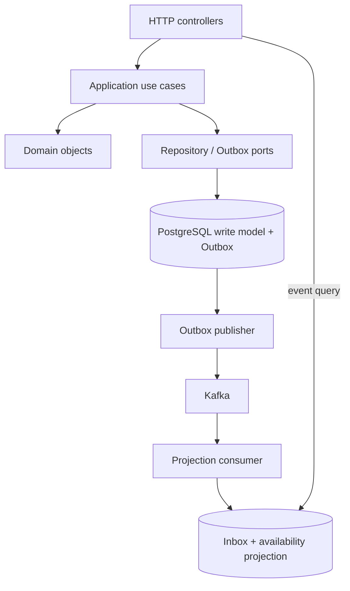
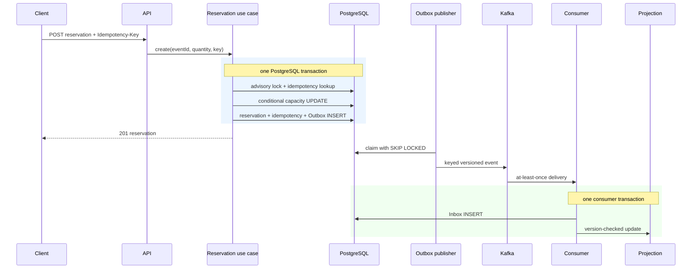

# Arquitetura

O sistema é um monólito modular executável em múltiplas instâncias. `interfaces` adapta HTTP, `application` coordena
casos de uso e transações, `domain` contém regras sem dependências de framework, e `infrastructure` implementa
PostgreSQL, Kafka, Outbox, Inbox e schedulers. A direção permanece `interfaces -> application -> domain`.

## Fluxos

* **Write:** REST → caso de uso → estado relacional autoritativo + evento na Outbox, na mesma transação PostgreSQL.
* **Async:** Outbox claim → Kafka → consumer → Inbox + projeção, na mesma transação PostgreSQL do consumer.
* **Read:** REST → `event_availability_projection`, eventualmente consistente.

A capacidade é concedida apenas pelo update condicional do write model. Kafka e a projeção nunca participam da decisão
anti-oversell. Idempotência HTTP, identificador do evento, versão do agregado e Inbox são mecanismos distintos.

Esta fase escolhe estado relacional autoritativo e eventos de domínio, **sem Event Sourcing e sem Event Store**. Outbox
é uma fila transacional; Kafka é transporte/retenção operacional. Nenhum deles é apresentado como Event Store.

Detalhes operacionais, garantias e recuperação estão em [event-driven-architecture.md](event-driven-architecture.md), e
as decisões resumidas em [adr](adr/).

Os mecanismos e provas para concorrência estão detalhados em [concurrency.md](concurrency.md) e no
[ADR 006](adr/006-concurrency-control.md).

## Component flow

Infrastructure depends inward on application ports and domain types; the domain does not import Spring, JPA, Kafka, or
HTTP. `interfaces` translates public transport contracts, and configuration wires adapters.

## Reservation sequence

