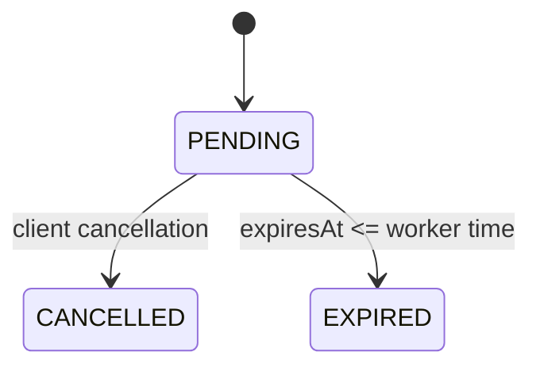

# Business rules

## Event and capacity

An event has a nonblank name (maximum 160 characters at the HTTP boundary), a future start time, and positive capacity.
It starts with `available_tickets = capacity`. PostgreSQL enforces `0 <= available_tickets <= capacity`; reservation
quantity must be positive. Capacity is granted only by the authoritative conditional database update.

## Reservation lifecycle

A reservation begins `PENDING` and expires ten minutes after creation by default (`RESERVATION_TTL` is configurable).
Only pending reservations consume capacity. Cancellation is replay-safe for an already cancelled reservation; cancelling
an expired reservation returns a conflict. Cancellation and expiration each restore capacity exactly once.

## Idempotency

`POST /events/{id}/reservations` requires an `Idempotency-Key` no longer than 160 characters. The semantic fingerprint
is
`eventId + quantity`. Reusing a key with the same fingerprint returns the original reservation; reuse with a different
fingerprint returns HTTP 409. Records are persistent and shared by every instance.

## Availability

Reservation commands use the transactional `events` row. `GET /events/{id}` uses
`event_availability_projection`, updated asynchronously from versioned domain events. It can briefly be stale or return
404 immediately after event creation, but it cannot authorize a sale.
