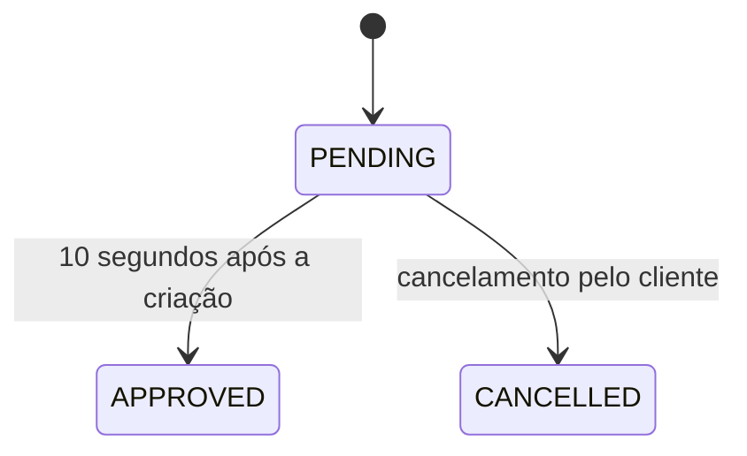

# Regras de negócio

## Evento e capacidade

Um evento tem nome não vazio (com no máximo 160 caracteres na fronteira HTTP), horário de início futuro e capacidade
positiva. Ele começa com `available_tickets = capacity`. O PostgreSQL garante
`0 <= available_tickets <= capacity`, e a quantidade da reserva deve ser positiva. A capacidade é concedida somente
pelo `UPDATE` condicional do banco de dados autoritativo.

## Ciclo de vida da reserva

Uma reserva começa como `PENDING` e é aprovada por um worker depois de dez segundos por padrão
(`RESERVATION_TTL` é configurável). O campo legado `expiresAt` representa o instante agendado para essa aprovação.
A capacidade é retida atomicamente durante a criação, evitando vendas acima do limite enquanto a aprovação está
pendente. Repetir o cancelamento de uma reserva já cancelada é seguro; cancelar uma reserva aprovada retorna conflito.

## Idempotência

`POST /eventos/{id}/reservas` exige uma `Idempotency-Key` de até 160 caracteres. A impressão digital semântica é
`eventId + quantity`. Reutilizar a chave com a mesma impressão digital retorna a reserva original; reutilizá-la com
outra impressão digital retorna HTTP 409. Os registros são persistentes e compartilhados por todas as instâncias.

## Disponibilidade

Os comandos de reserva usam a linha transacional da tabela `events`. `GET /eventos/{id}` usa a projeção
`event_availability_projection`, atualizada de forma assíncrona por eventos de domínio versionados. Enquanto a projeção
ainda não existe logo após a criação, a consulta usa a linha autoritativa como fallback em vez de retornar um falso 404.
Uma projeção já existente ainda pode ficar brevemente desatualizada, mas nunca autoriza uma venda.
