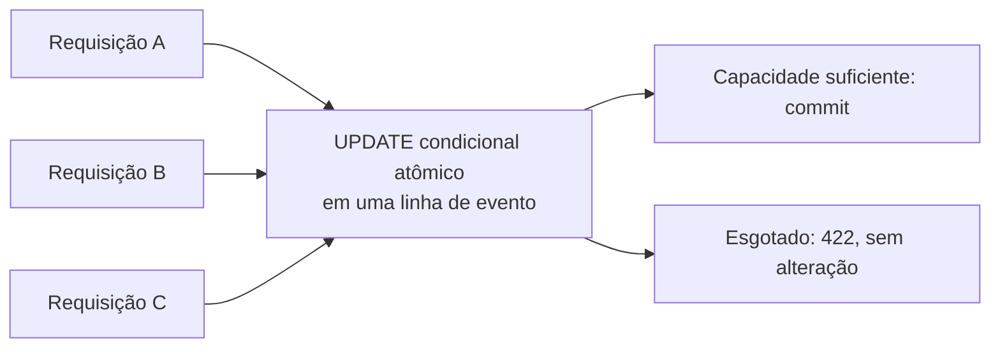

# Concorrência e consistência

## Venda além da capacidade

O write model concede capacidade com `UPDATE events SET available_tickets = available_tickets - :quantity,
version = version + 1 WHERE id = :id AND available_tickets >= :quantity RETURNING available_tickets, version`.
O lock de linha inerente ao update e a reavaliação do predicado pelo PostgreSQL serializam concorrentes, inclusive
vindos
de JVMs diferentes. As constraints mantêm `0 <= available_tickets <= capacity`. A projeção nunca autoriza uma venda.

## Atomicidade

Uma criação engloba advisory lock da chave, leitura da idempotência, aquisição de capacidade, insert da reserva, insert
do
registro idempotente e insert da Outbox em uma transação. Qualquer exceção reverte tudo. Kafka não está no request path.

## Idempotência

`Idempotency-Key` é obrigatório. SHA-256 é calculado da representação canônica de `eventId` e `quantity`. O advisory
lock
transacional distribui exclusão entre instâncias; a constraint `UNIQUE` é a defesa final. Mesmo payload retorna a
reserva
original com 201; payload diferente retorna 409. Uma falha causa rollback inclusive do lock/registro; retry após commit
reencontra a resposta persistida.

## Cancelamento

`SELECT ... FOR UPDATE` serializa operações sobre a reserva. A primeira transição `PENDING -> CANCELLED` devolve
ingressos
e cria um evento. Repetir DELETE de uma reserva já cancelada devolve o mesmo estado sem nova liberação ou evento (200).
Cancelar uma reserva expirada é conflito 409.

## Expiração

Workers selecionam somente vencidas pendentes via `FOR UPDATE SKIP LOCKED`. Uma linha fica em exatamente um lote; apenas
a transição vencedora libera capacidade e escreve `ReservationExpired`.

## Cancelamento versus expiração

Ambos adquirem o mesmo lock pessimista da reserva antes de alterar o evento. Um encontra `PENDING`; o outro observa o
estado
terminal após o commit. Assim somente um evento terminal e uma liberação ocorrem.

## Consistência eventual

Outbox e estado são atômicos, mas publicação é at-least-once. Inbox `(event_id, consumer)` deduplica na mesma transação
da
projeção. A versão agregada aceita o próximo evento, ignora versões antigas e rejeita gaps. O read model pode atrasar,
mas
converge sem participar da proteção de capacidade.

## Teste multi-instance

Execute `docker compose up --build --scale app=3`. O Nginx em `localhost:8080` distribui chamadas às réplicas, que usam
o
mesmo PostgreSQL. Crie um evento e execute `EVENT_ID=<uuid> docker compose --profile load-test run --rm k6`. O script
considera 422 por
esgotamento um resultado de negócio; valide a correção pela suíte Testcontainers e pelo estado persistido, não pelo k6.

`ReservationConcurrencyIT` não sobe aplicações completas: ele exercita os mesmos beans transacionais por
threads, conexões e transações independentes contra PostgreSQL real. Seus cenários cobrem 100 compradores, quantidades
variáveis, 50 retries da mesma chave, cancelamento, múltiplos expiradores, cancelamento versus expiração, expiração
versus
novas reservas, rollback e Inbox/projeção duplicada. A demonstração de três processos completos é o Compose acima.

## Modelo de contenção

Um único evento muito disputado pode concentrar dezenas de milhares de requisições na mesma linha. Várias JVMs melhoram
a vazão HTTP, mas não removem esse ponto de serialização. O desenho atual escolhe intencionalmente correção e simplicidade
operacional. Em escala muito maior, propriedade particionada, controle de admissão ou sala de espera, backpressure e
sharding por evento podem limitar a contenção; essas opções exigem outro modelo operacional e não são prometidas aqui.
